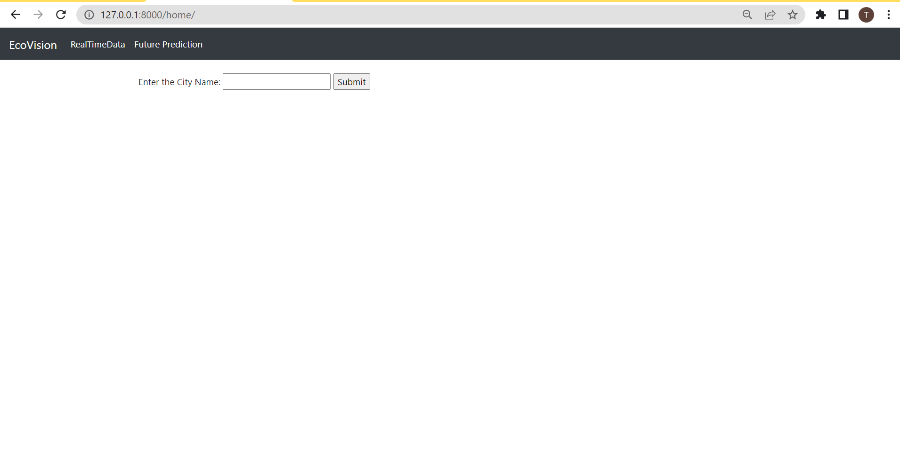
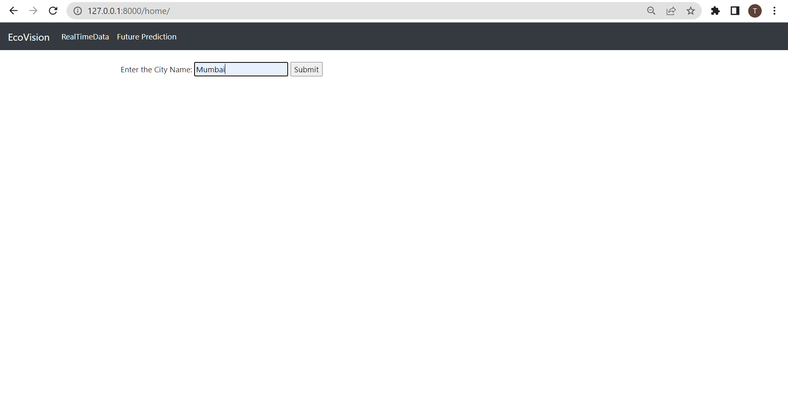
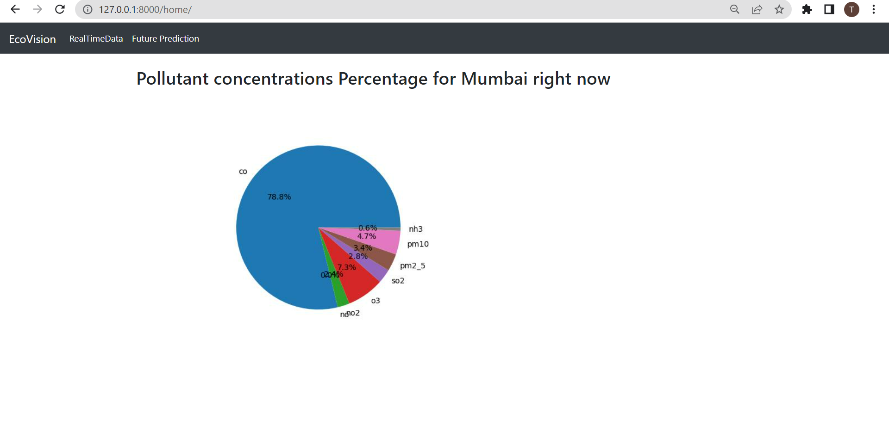
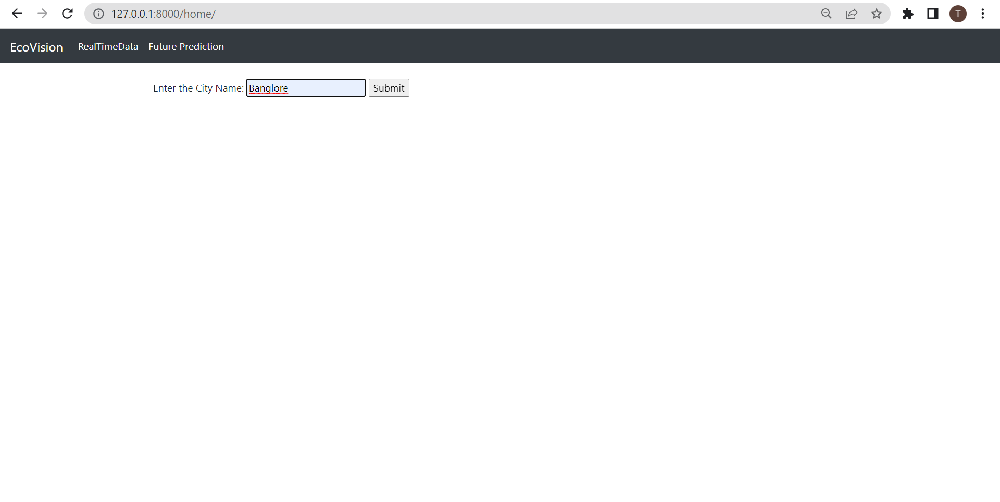
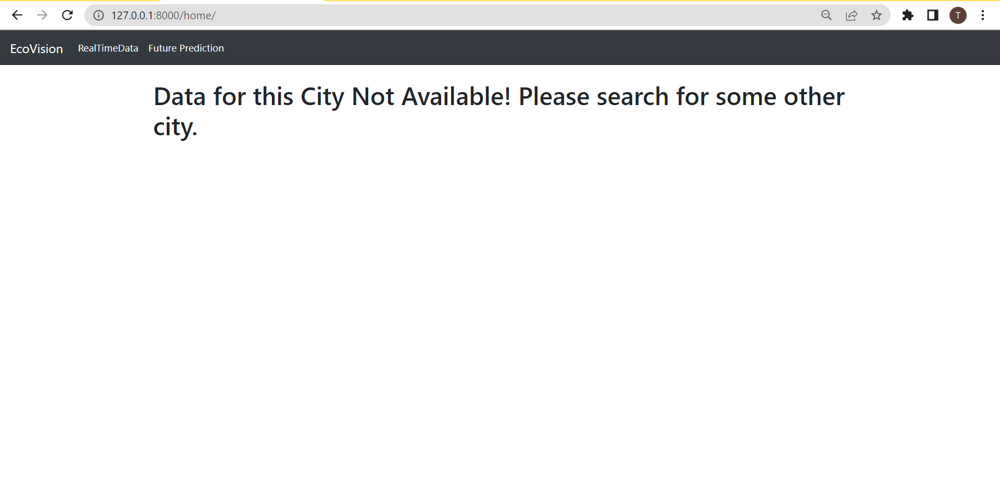
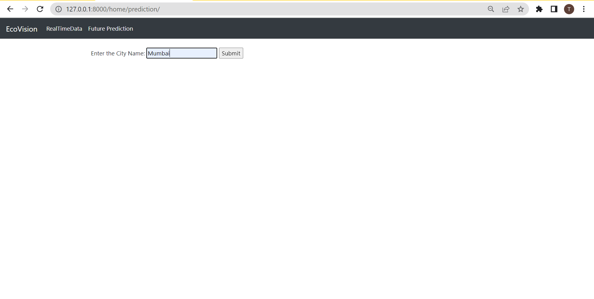
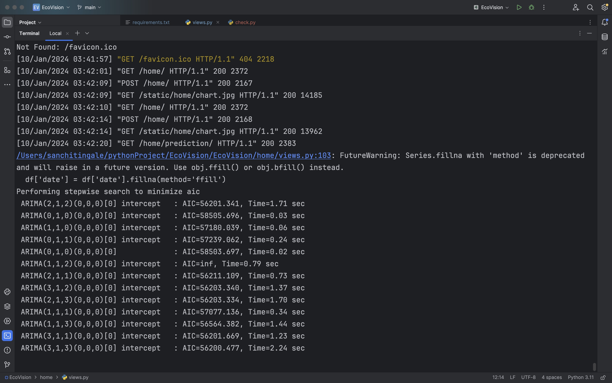
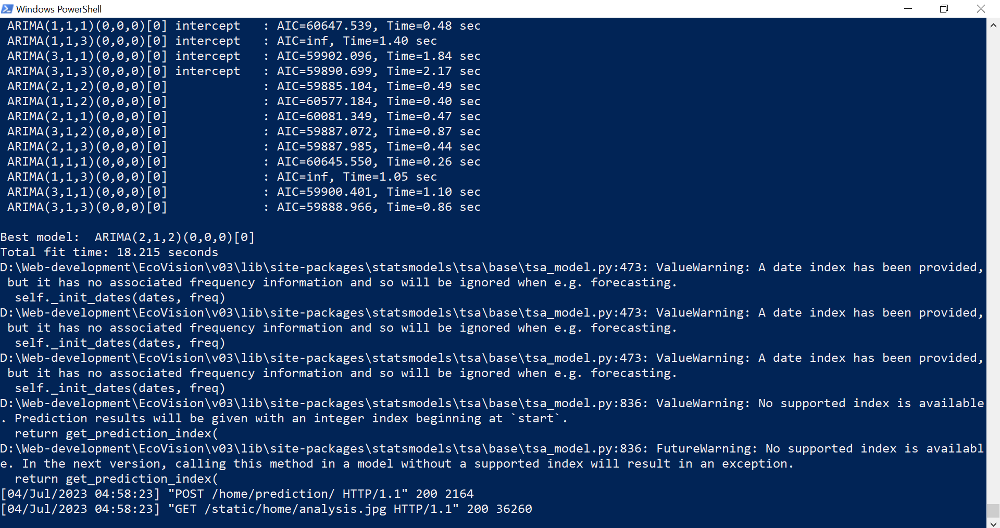
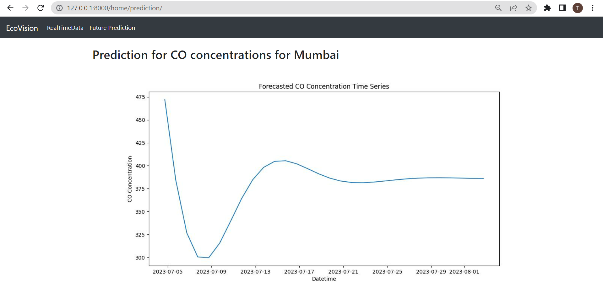

# EcoVision
EcoVision is a web application that provides real-time and future predictions of air pollution data. It utilizes data from data sources to display pollutant concentrations for different cities and offers forecasting capabilities using time series analysis.

**Steps to run it locally on your machine.**

(I have used Windows Powershell, some commands may where. Please look for specific commands for your OS)

**Step 1**: Open Windows PowerShell/Command Prompt on your device.

**Step 2**: Download Python and make sure pip is installed.
        To check if installed successfully,
        
        command for python check : python --version
        
        command for pip check : pip -- version

If both commands show their respective versions, python and pip installed successfully.

**Step 3**: Download virtual environment to keep the versioning of dependencies of project limited to that project. This way, you can create different projects with different versions of dependencies.

        Command: pip install virtualenv
        
**Step 4**: Create virtual environement

        command: virtualenv <env_name>
        Eg. virtualenv v1
        
**Step 5**: Activate virtual environment

Go to the location where your virtual environment is created.

        Windows-
              command: <env_name>/Scripts/activate
        Linux/macOS-
              command: source <env_name>/bin/activate
              
**Step 6**: Clone the repository
        
        command: git clone https://github.com/TANISHA-P/EcoVision.git
        
**Step 7**: cd the location where the repository is cloned. You'll find a directory named 'EcoVision'

        command: cd EcoVision
                 pip install -r requirements.txt
        (It may take some time to install)
        
To check for all installed requirements:

        command: pip list
**Step 8**: Run the development server
        command: python manage.py runserver
This starts the development server. 

Once it starts, you'll see a line 'Starting development server at http://127.0.0.1:8000/'. 

Copy the url(http://127.0.0.1:8000/). 

Paste it in the browser and append '/home' to it.

        Final url = http://127.0.0.1:8000/home
    
Press Enter. 

The website is running on local server under debug mode. All the debug data can be seen on PowerShell.

**Images**

RealTimeData View for City to provide real-time insights and visualizations to understand the current state of pollutant Concentrations in that city.

Taking Input

Displaying Pie-Chart with Percentage of Pollutants in the Air

Handing case for when the city data isn't present

Output

Future Prediction Inputing City name to predict next 30 days forecast for CO concentration in μg/m3

Debug Data in Windows PowerShell

Displaying Output

